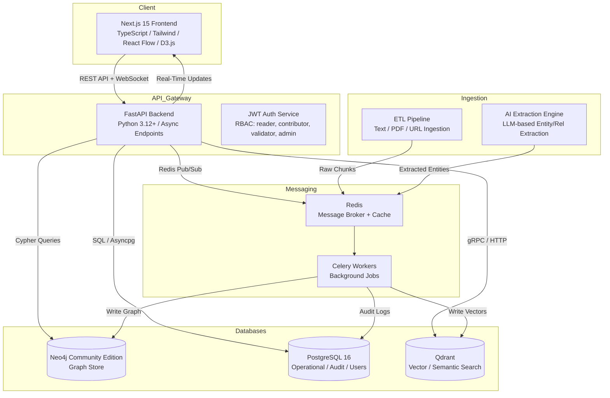

# Torah Knowledge Graph — System Architecture

## 1. Overview

The Torah Knowledge Graph (TKG) is an interactive web platform for exploring Jewish textual and mystical traditions through a unified graph database. It connects verses, people, concepts, sefirot, divine names, prayers, promises, segulot, tikkunim, and more in a navigable knowledge network.

### 1.1 Design Goals
- **Explorability**: Users traverse the graph interactively via a visual canvas.
- **Semantic Depth**: Every node is semantically searchable via vector embeddings.
- **Collaborative Curation**: Community contributors submit nodes and relationships; validators review them.
- **AI-Assisted Ingestion**: Background jobs extract entities and relationships from raw texts.
- **Scalability**: Horizontal scaling for ingestion, search, and visualization workloads.

### 1.2 High-Level Service Diagram (Mermaid)



## 2. Technology Stack

### 2.1 Frontend
| Technology | Purpose |
|------------|---------|
| **Next.js 15** | App Router, SSR/SSG, API route proxies |
| **TypeScript** | Type safety across the entire UI layer |
| **Tailwind CSS** | Utility-first styling, responsive design |
| **React Flow** | Interactive graph canvas (nodes, edges, layouts) |
| **D3.js** | Custom force-directed layouts, hierarchical visualizations |
| **shadcn/ui** | Accessible component primitives |
| **TanStack Query** | Server-state synchronization, caching, optimistic updates |
| **Zustand** | Lightweight client-state for UI preferences |

### 2.2 Backend
| Technology | Purpose |
|------------|---------|
| **FastAPI** | Async Python web framework, automatic OpenAPI generation |
| **Python 3.12+** | Language runtime |
| **uvicorn** | ASGI server (HTTP/1.1 + HTTP/2) |
| **pydantic v2** | Request/response validation and serialization |
| **asyncpg** | Async PostgreSQL driver |
| **neo4j-python-driver** | Bolt protocol async driver for Neo4j |
| **qdrant-client** | Async Qdrant Python client |
| **redis-py** | Async Redis client for caching and pub/sub |
| **celery** | Distributed task queue for background jobs |

### 2.3 Databases
| Database | Role | Data Stored |
|----------|------|-------------|
| **Neo4j Community Edition** | Graph store | Nodes, relationships, graph topology, traversal queries |
| **PostgreSQL 16** | Operational / Relational | Users, roles, audit logs, ingestion jobs, AI extraction jobs, review queues, metadata |
| **Qdrant** | Vector search | Dense embeddings of nodes and texts for semantic similarity |

### 2.4 Infrastructure & Messaging
| Technology | Role |
|------------|------|
| **Redis** | Celery broker + result backend, ephemeral cache, WebSocket pub/sub |
| **Celery** | Background job processing (ETL, AI extraction, vector index updates) |
| **Docker + Docker Compose** | Local development and single-node deployment |
| **Nginx** | Reverse proxy, TLS termination, static asset serving |

## 3. Authentication & Authorization

### 3.1 JWT-Based Authentication
- Access tokens: short-lived (15 minutes), signed RS256.
- Refresh tokens: long-lived (7 days), stored in httpOnly cookies, rotated on every use.
- Password hashing: Argon2id via `passlib`.

### 3.2 Role-Based Access Control (RBAC)

| Role | Permissions |
|------|-------------|
| **reader** | Browse, search, visualize, read all public nodes and relationships. No mutations. |
| **contributor** | All reader permissions + create nodes/relationships, submit edits, flag errors. Owns their submissions. |
| **validator** | All contributor permissions + review pending submissions, approve/reject with comment, edit any public node. |
| **admin** | All validator permissions + manage users, run ingestion pipelines, configure system settings, view audit logs. |

### 3.3 Permission Enforcement
- FastAPI dependency `require_role(...)` checks JWT claims on every protected endpoint.
- Row-level security in PostgreSQL enforces audit log isolation.
- Neo4j has no native RBAC at graph element level; application layer enforces visibility by filtering Cypher results based on `status` property (`public`, `pending`, `rejected`).

## 4. Data Flow

### 4.1 Ingestion Pipeline

```
┌──────────────┐    ┌──────────────┐    ┌──────────────┐    ┌──────────────┐
│   Source     │───▶│    ETL       │───▶│   Celery     │───▶│   Neo4j      │
│ (Text/PDF/   │    │  (Parse /     │    │  Workers     │    │  (Graph      │
│  URL / API)  │    │  Chunk /      │    │  (Batch      │    │   Store)     │
└──────────────┘    │  Clean)       │    │   Write)     │    └──────────────┘
                    └──────────────┘    └──────────────┘
                           │                  │
                           ▼                  ▼
                    ┌──────────────┐    ┌──────────────┐
                    │  PostgreSQL  │    │   Qdrant     │
                    │ (Job Status  │    │  (Vector     │
                    │  / Audit)    │    │   Index)     │
                    └──────────────┘    └──────────────┘
```

1. **Source**: Raw Torah texts (Tanakh, Talmud, Zohar, commentaries), uploaded as files or fetched via URL.
2. **ETL**: FastAPI ingestion endpoint queues a Celery task. The ETL worker parses, chunks, and cleans text.
3. **AI Extraction (Optional)**: A Celery task sends chunks to an LLM (e.g., Claude API) to extract entities and relationships. Results are stored in a review queue (PostgreSQL).
4. **Graph Write**: Validated extractions are written to Neo4j as nodes and relationships.
5. **Vector Index**: Node texts and descriptions are embedded (e.g., `text-embedding-3-large`) and upserted into Qdrant with the Neo4j node ID as payload.
6. **Audit**: Every write is logged in PostgreSQL with `user_id`, `action`, `entity_type`, `entity_id`, `timestamp`, `diff`.

### 4.2 Query Flow

```
User Query
    │
    ├──▶ Full-Text Search ──▶ Neo4j Full-Text Index ──▶ Results
    │
    ├──▶ Vector Search ────▶ Qdrant ──▶ Neo4j Node Lookup ──▶ Results
    │
    ├──▶ Hybrid Search ────▶ Qdrant + Neo4j FTS ──▶ RRF Rerank ──▶ Results
    │
    └──▶ Graph Traversal ──▶ Cypher Query ──▶ Neo4j ──▶ Results
```

### 4.3 Real-Time Updates (WebSocket)
- When a contributor creates a node, the backend publishes the event to a Redis channel.
- WebSocket managers (per graph session) subscribe to Redis and broadcast new/updated nodes to connected clients.
- React Flow receives the payload and merges it into the local graph state via TanStack Query optimistic updates.

## 5. Service Communication Patterns

### 5.1 REST API
- Primary interface between frontend and backend.
- JSON request/response bodies, `application/json` content type.
- Standard HTTP verbs: GET (read), POST (create), PUT (full update), PATCH (partial update), DELETE (remove).
- Pagination via cursor-based `page_size` + `next_cursor` for graph list endpoints.
- Consistent error envelope: `{ "error": "ErrorCode", "message": "human readable", "detail": {} }`.

### 5.2 WebSocket
- Endpoint: `/ws/graph/{session_id}`.
- Protocol: JSON messages over WebSocket.
- Message types:
  - `node.created`, `node.updated`, `node.deleted`
  - `relationship.created`, `relationship.updated`, `relationship.deleted`
  - `graph.layout.update` (force-directed layout progress)
- Authentication: JWT passed in the `Authorization` header during the WebSocket handshake.

### 5.3 Inter-Service (Backend → Data Stores)
- Neo4j: Bolt protocol over TCP (port 7687). Async driver with connection pooling.
- PostgreSQL: TCP (port 5432). `asyncpg` with a connection pool (min 5, max 20).
- Qdrant: gRPC (port 6334) or HTTP (port 6333). Async client preferred.
- Redis: TCP (port 6379). Async Redis client for Celery broker and cache.

## 6. Data Boundaries

| Store | Ownership | What Lives Here | What Does NOT Live Here |
|-------|-----------|-----------------|------------------------|
| **Neo4j** | Graph topology | Nodes, relationships, properties essential for traversal (e.g., `gematria_value`, `sefirah_association`) | User credentials, audit logs, job metadata, embeddings |
| **PostgreSQL** | Operational / Audit | Users, roles, RBAC permissions, ingestion jobs, AI extraction jobs, review queues, audit logs, system configuration | Graph topology, raw embeddings, full text of long documents |
| **Qdrant** | Semantic Search | Vector embeddings of node texts/descriptions, payload with `node_id` and `node_type` for cross-lookup | Human-readable graph structure, relationship types |

This separation ensures:
- Neo4j remains optimized for traversals and pattern matching.
- PostgreSQL remains the source of truth for operational state and auditability.
- Qdrant remains the source of truth for semantic similarity.

## 7. Scalability & Performance

### 7.1 Read Scaling
- Neo4j Community Edition is single-node. For read-heavy workloads, cache frequently traversed subgraphs in Redis (e.g., Sefirot tree, Book-Chapter-Verse hierarchy).
- Qdrant supports horizontal sharding natively for vector search scaling.
- PostgreSQL read replicas can be added for audit log queries.

### 7.2 Write Scaling
- All writes to Neo4j go through Celery workers to batch Bolt transactions and reduce lock contention.
- Vector upserts are batched (100–500 points per Qdrant upsert call).
- Ingestion jobs are chunked and processed in parallel Celery tasks with rate limiting against Neo4j.

### 7.3 Caching Strategy
- Redis caches:
  - Full graph neighborhood for hot nodes (TTL: 5 minutes).
  - Search autocomplete suggestions (TTL: 1 hour).
  - User sessions and JWT blacklists (TTL: matches token expiry).

## 8. Security Considerations

- **Cypher Injection**: All user input passed to Neo4j uses parameterized queries exclusively. No string interpolation in Cypher.
- **SQL Injection**: `asyncpg` with parameterized queries only.
- **XSS**: Frontend sanitizes all node properties before rendering. React Flow node content is rendered as text or trusted SVG, never raw HTML.
- **CSRF**: Stateless JWT in `Authorization` header; cookies are `SameSite=Strict` where used for refresh tokens.
- **Rate Limiting**: Redis-backed rate limits per IP and per user (e.g., 100 req/min for readers, 20 req/min for contributors creating nodes).
- **Input Validation**: Pydantic v2 models enforce max string lengths, allowed enum values, and regex patterns (e.g., Hebrew Unicode ranges).
- **Secrets Management**: Database credentials and API keys stored in environment variables or a secrets manager (e.g., HashiCorp Vault), never committed.

## 9. Deployment Architecture

```
┌─────────────────────────────────────────────────────────────────┐
│                         Nginx (Reverse Proxy)                    │
│                    TLS 1.3, Rate Limiting, Gzip                  │
└──────────────┬────────────────────────────────┬─────────────────┘
               │                                │
    ┌──────────▼──────────┐          ┌─────────▼──────────┐
    │  Next.js Frontend   │          │   FastAPI Backend  │
    │   (Docker)          │          │    (Docker)        │
    └─────────────────────┘          └─────────┬──────────┘
                                               │
                              ┌────────────────┼────────────────┐
                              │                │                │
                    ┌─────────▼────────┐ ┌─────▼─────┐ ┌───────▼──────┐
                    │  Neo4j Community │ │PostgreSQL  │ │   Qdrant     │
                    │    (Docker)      │ │  (Docker) │ │  (Docker)    │
                    └──────────────────┘ └───────────┘ └──────────────┘
                              │
                    ┌─────────▼────────┐
                    │  Redis (Docker)  │
                    └──────────────────┘
```

- All services containerized with Docker Compose for local/staging.
- Production can migrate to Kubernetes with Helm charts for each service.
- Health checks: `/health` for FastAPI, Neo4j bolt ping, PostgreSQL `SELECT 1`, Qdrant `/healthz`, Redis `PING`.

## 10. Monitoring & Observability

- **Structured Logging**: JSON logs from FastAPI (via `structlog`) shipped to a log aggregator.
- **Metrics**: Prometheus endpoint (`/metrics`) exposing request latency, Neo4j query duration, Celery queue depth, Qdrant search latency.
- **Tracing**: OpenTelemetry instrumentation across FastAPI, Neo4j driver, and Qdrant client for distributed trace visibility.
- **Alerting**: Celery queue depth > 1000 or failed job rate > 5% triggers alerts.

## 11. Development Conventions

- **Python**: `ruff` (line-length 100), `pyright` strict mode, `uv` for dependency management.
- **TypeScript**: ESLint + Prettier, strict `tsconfig.json`.
- **API Versioning**: URL path versioning (`/api/v1/...`). Breaking changes bump the version.
- **Environment**: `.env.example` committed; actual `.env` never committed.
- **Migrations**: PostgreSQL via `alembic`. Neo4j schema managed via idempotent Cypher scripts run on startup.
